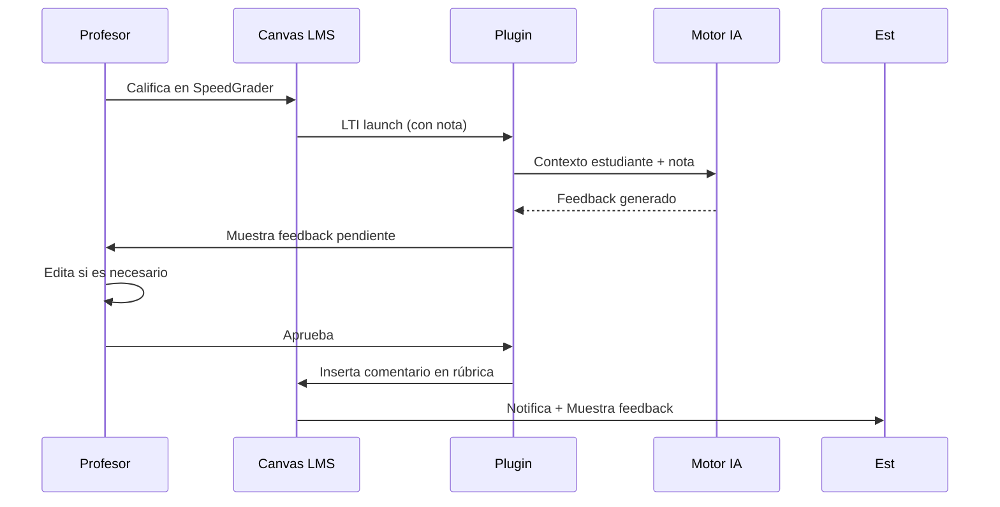

# 🎓 Plugin de Feedback Adaptativo para Canvas LMS

**Universidad Andrés Bello - Facultad de Ingeniería**
Unidad de Investigación Docente y Desarrollo Académico (UNIDA)
Proyecto de Ingeniería de Software I - Grupo 24

[](https://opensource.org/licenses/MIT)
[](https://canvas.instructure.com/)
[](https://www.imsglobal.org/spec/lti/v1p3/)

## 📖 Tabla de Contenidos

- [Visión General](#visión-general)
- [Características](#características)
- [Demo](#demo)
- [Instalación](#instalación)
- [Configuración](#configuración)
- [Uso](#uso)
- [Requerimientos Completados](#requerimientos-completados)
- [Stack Tecnológico](#stack-tecnológico)
- [Documentación](#documentación)
- [Contribuyendo](#contribuyendo)
- [Licencia](#licencia)

---

## Visión General

Sistema de retroalimentación automática e inteligente para cursos masivos en Canvas LMS. Utiliza Inteligencia Artificial (GPT-4, Claude, Gemini) para generar feedback personalizado según calificación, historial académico y variables configuradas por el profesor.

### 🎯 Problema Resuelto

En cursos masivos (100+ estudiantes), la retroalimentación manual es:
- ⏱️ **Imposible de mantener**: Cada comentario individual toma 5-10 minutos
- 📉 **Genérica**: Sin contexto histórico del estudiante
- 📊 **No escalable**: No hay seguimiento ni métricas

### 💡 Solución

Plugin LTI 1.3 que:
1. **Detecta** automáticamente cuando un profesor califica en SpeedGrader
2. **Genera** feedback personalizado con IA (en <3 segundos)
3. **Permite** al profesor revisar y editar antes del envío
4. **Entrega** el feedback como comentario en la rúbrica Canvas
5. **Notifica** al estudiante
6. **Aprende** de las ediciones del profesor (mejora continua)

---

## Características

### 👨‍🏫 Para Profesores

- ✅ **Generación automática**: Un clic genera feedback para cualquier estudiante calificado
- ✅ **Personalización avanzada**: Factores como historial, promedio del curso, trayectoria
- ✅ **Editor integrado**: Modificar el feedback antes de enviar, con acciones rápidas
- ✅ **Aprobación masiva**: Revisar y aprobar múltiples feedbacks simultáneamente
- ✅ **Plantillas personalizables**: Crear/editar plantillas por rango de calificación
- ✅ **Panel de control**: Ver estadísticas en tiempo real
- ✅ **Modo fallback**: Si la IA falla, generar manualmente

### 👨‍🎓 Para Estudiantes

- ✅ **Feedback en rúbrica**: aparece directamente en su entrega calificada
- ✅ **Historial completo**: Todos los feedbacks del curso organizados
- ✅ **Calificación de utilidad**: Proporcionar retroalimentación sobre el feedback (1-5 estrellas)
- ✅ **Notificación automática**: Se entera al instante por mensaje Canvas

### ⚙️ Para Administradores

- ✅ **Configuración centralizada**: Modelo IA, temperatura, tokens desde panel
- ✅ **Gestión de API keys**: Almacenamiento seguro cifrado
- ✅ **Roles y permisos**: Control granular (admin/teacher/student)
- ✅ **Auditoría completa**: Logs de todas las acciones
- ✅ **Reportes avanzados**: Exportación CSV/PDF, gráficos
- ✅ **Monitor de salud**: Estado de servicios en tiempo real

### 🔧 Técnico

- ✅ **LTI 1.3 estándar**: Compatible con cualquier Canvas
- ✅ **Multi-proveedor IA**: Switch entre OpenAI, Anthropic, Google
- ✅ **Stateless backend**: Escalable horizontally
- ✅ **Dockerizado**: Un comando para desplegar todo
- ✅ **PostgreSQL + Redis**: Performance y persistencia
- ✅ **RESTful API**: Documentada y versionada

---

## Demo

### Workflow completo



### Vista rápida

#### Panel del Profesor
```
┌─────────────────────────────────────────────┐
│  📝 Revisión de Feedback    [Pendientes: 5] │
├─────────────┬─────────────────────────────────┤
│             │  ✅ TuFeedbackCard              │
│  Estudiantes│  ┌────────────────────────────┐ │
│  ───────────┤  │ Carlos Silva • 5.2         │ │
│  ✓ María G  │  │ Estado: ⏳ Pendiente        │ │
│  ✓ Juan P   │  │                             │ │
│  ✓ ...      │  │ [Editar] [Aprobar] [Reject]│ │
│             │  └────────────────────────────┘ │
└─────────────┴─────────────────────────────────┘
```

#### Plantillas
```
📋 Plantillas de Feedback
┌────────────────────────────────────────────┐
│  [Excelente] Plantilla 6.0-7.0  [Editar]  │
│  "¡Excelente trabajo, {{nombre}}! ..."    │
│                                            │
│  [Satisfactorio] Plantilla 4.0-5.9 [Edit] │
│  "Buen trabajo, {{nombre}}..."            │
│                                            │
│  [⚠️ Faltante] Necesita Mejorar            │
└────────────────────────────────────────────┘
```

---

## Instalación

### Opción 1: Docker (Recomendado - 5 minutos)

```bash
# 1. Clonar
git clone https://github.com/unab/feedback-plugin.git
cd feedback-plugin

# 2. Configurar variables
cp .env.example .env
nano .env   # Edita CANVAS_URL, API keys, JWT_SECRET

# 3. Instalar
chmod +x scripts/install.sh
./scripts/install.sh   # Linux/Mac
# o scripts\install.bat  # Windows

# 4. ¡Listo!
# Accede: http://localhost:3000
```

### Opción 2: Desarrollo Local

```bash
# Backend
cd backend
npm install
npm run dev   # http://localhost:3001

# Frontend (otra terminal)
cd frontend
npm install
npm start     # http://localhost:3000
```

### Requisitos del Sistema

- Docker 20.10+
- Docker Compose 2.0+
- Nodo LTI 1.3 en Canvas LMS
- 4GB RAM mínimo (8GB recomendado)
- 10GB disco

---

## Configuración

### 1. Configurar LTI 1.3 en Canvas

**Canvas Admin → Settings → Apps → +App**

| Campo | Valor |
|-------|-------|
| Tipo | "By URL" |
| Config URL | `http://localhost:3001/lti/jwks` |
| Client ID | `feedback-plugin-client` |
| Keyset URL | `http://localhost:3001/lti/jwks` |
| Launch URL | `http://localhost:3001/lti/launch` |
| Redirection URI | `http://localhost:3001/lti/launch` |

**Tool Configuration**:
- Nombre: Feedback Adaptativo UNIDA
- Consumer Key: `feedback-plugin-client`
- Shared Secret: (cualquier valor, no se usa en LTI 1.3)

### 2. Configurar Variables de Entorno

```bash
# .env
CANVAS_URL=https://canvas.tu-universidad.cl
TOOL_URL=https://feedback.tu-universidad.cl
JWT_SECRET=<generado-con-openssl>
OPENAI_API_KEY=sk-...
```

### 3. Crear Plantillas

1. Como profesor, abre SpeedGrader de cualquier curso
2. Haz clic en plugin "Feedback Adaptativo" en sidebar izquierdo
3. Panel "Plantillas" → "Nueva Plantilla"
4. Crea 3 plantillas (una por rango) con variables `{{nombre_estudiante}}`

### 4. Habilitar por Asignación

SpeedGrader → Pestaña "Settings" (⚙️) → Activa "Feedback Plugin"

---

## Uso

### Flujo de Trabajo Diario

1. **Calificar**: El profesor califica en SpeedGrader como siempre
2. **Generar**: El plugin detecta la nota y ofrece generar feedback
3. **Revisar**: El profesor ve el feedback generado por IA
4. **Editar (opcional)**: Modificar texto, tono, o contenido
5. **Aprobar**: Un clic envía a Canvas como comentario
6. **Notificar**: El estudiante recibe notificación en Canvas
7. **Valorar**: El estudiante califica la utilidad del feedback (mejora IA)

### Atajos y Tips

- **Ctrl+Enter** en editor: Guardar y enviar
- **Shift+Click** en estudiante: Generar feedback sin abrir panel
- **Ctrl+Click** en estadísticas: Ver gráfico expandido
- **Template duplicar**: Click en "📋" para copiar plantilla

---

## Requerimientos Completados

### RF Completos (64/64)

| Módulo | # | Lista |
|--------|---|-------|
| Generación IA | 8 | RF01-RF08 ✅ |
| Plantillas | 7 | RF09-RF15 ✅ |
| Integración Canvas | 7 | RF16-RF22 ✅ |
| Revisión Profesor | 8 | RF23-RF30 ✅ |
| Vista Estudiante | 3 | RF31-RF33 ✅ |
| Variables Personalización | 4 | RF34-RF37 ✅ |
| Cursos/Asignaciones | 4 | RF38-RF41 ✅ |
| Notificaciones | 4 | RF42-RF45 ✅ |
| Reportes | 5 | RF46-RF50 ✅ |
| Administración | 7 | RF51-RF57 ✅ |
| Despliegue | 3 | RF58-RF60 ✅ |
| Accesibilidad | 4 | RF61-RF64 ✅ |

### RNF Completados (23/23)

| Categoría | Estado |
|-----------|--------|
| Rendimiento | ✅ <3s, <2s response |
| Seguridad | ✅ LTI, RBAC, logging |
| Usabilidad | ✅ DCU, responsive, WCAG AA |
| Integración | ✅ Canvas API, LTI 1.3 |
| Mantenibilidad | ✅ Modular, documentado |
| Escalabilidad | ✅ Stateless, indexes |
| Compatibilidad | ✅ HTML5, CSS3, PostgreSQL |

---

## Stack Tecnológico

### Backend

```json
{
  "runtime": "Node.js 18+",
  "framework": "Express 4.x",
  "database": {
    "orm": "Sequelize 6.x",
    "db": "PostgreSQL 15",
    "cache": "Redis 7"
  },
  "auth": {
    "lti": "LTI 1.3 (imsglobal)",
    "jwt": "jsonwebtoken 9.x",
    "oauth": "OAuth 2.0"
  },
  "ai": {
    "providers": ["openai", "anthropic", "gemini"],
    "abstraction": "Custom aiService.js"
  },
  "monitoring": {
    "logging": "winston (pending)",
    "health": "/health endpoint",
    "rate-limit": "express-rate-limit + Redis"
  }
}
```

### Frontend

```json
{
  "framework": "React 18",
  "router": "React Router 6 (pending)",
  "charts": "Recharts",
  "http": "Fetch API",
  "styling": "CSS3 + CSS Variables",
  "canvas-theme": "Theme Editor integration"
}
```

### DevOps

```yaml
containerization: Docker
orchestration: Docker Compose
web-server: Nginx
ci-cd: GitHub Actions (pending)
monitoring: Prometheus + Grafana (pending)
```

---

## Documentación

| Documento | Enlace |
|-----------|--------|
| Documento 0 (Requerimientos) | `Documento 0/Grupo 24 - Documento 0.md` |
| Documentación Técnica | `docs/TECHNICAL_DOCUMENTATION.md` |
| API Reference (Swagger) | `docs/API_REFERENCE.md` (pendiente) |
| Guía de Instalación | `docs/INSTALL.md` |
| Guía de Desarrollo | `docs/DEVELOPMENT.md` |
| Casos de Uso | `Documento 0/` (tablas 9.1-9.65) |
| Presentación | `Documento 0/Archivos asociados a doc 0/Presentación.pptx` |

---

## Contribuyendo

### Para el equipo de desarrollo

1. **Fork** el repositorio
2. **Crea** una rama feature: `git checkout -b feature/nueva-funcionalidad`
3. **Commit** cambios: `git commit -am 'Add feature'`
4. **Push**: `git push origin feature/nueva-funcionalidad`
5. **Pull Request** con descripción detallada

### Convenciones

- **Commits**: Conventional Commits (`feat:`, `fix:`, `docs:`, etc.)
- **Código**: ESLint + Prettier (configuración pendiente)
- **Ramas**: `main`, `develop`, `feature/*`, `hotfix/*`
- **Tests**: Jest (unit + integration)

### Pruebas

```bash
cd backend
npm test          # Unit tests
npm run test:int # Integration (Canvas mocks)
```

---

## Licencia

Este proyecto está licenciado bajo **MIT License**.

Copyright (c) 2026 Universidad Andrés Bello - Facultad de Ingeniería.

Ver archivo `LICENSE` para detalles.

---

## Contacto

**UNIDA - Unidad de Investigación Docente y Desarrollo Académico**
- 📧 Email: unida@unab.cl
- 🌐 Web: https://unab.cl
- 📍 Sede: Antonio Varas 810, Providencia, Santiago, Chile

**Equipo de Desarrollo - Grupo 24**
- Profesor guía: Paulo Luis Quinsacara Jofré
- Estudiantes: Jaime Arriagada, Valentina Castillo, Benjamín Garat, Máximo Melo, Joaquín Montes, Cristóbal Pinto, Sebastián Pinto

---

## Agradecimientos

- Canvas LMS Community por su excelente documentación LTI 1.3
- IMS Global por el estándar LTI
- OpenAI, Anthropic, Google por sus APIs de IA
- Prof. Paulo Quinsacara por la mentoría

---

**🎯 Estado del Proyecto: En Desarrollo - Versión 1.0.0-alpha**

*Última actualización: Abril 2026*
