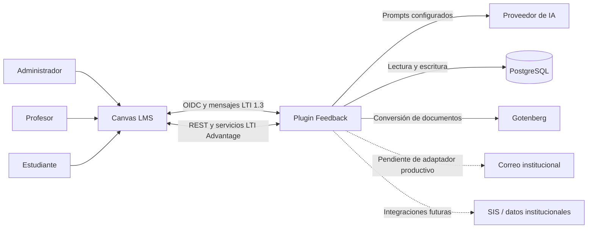
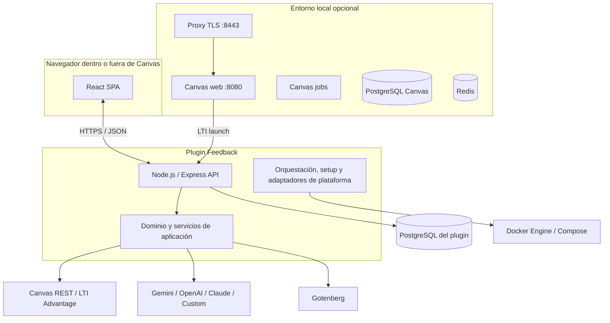
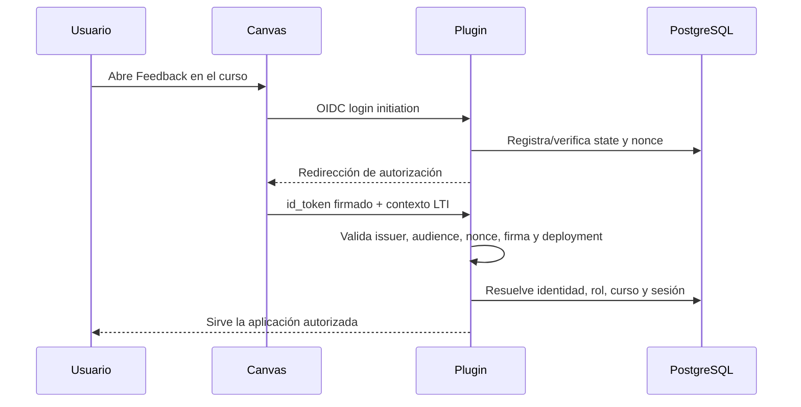

# Arquitectura del sistema

Este documento describe la arquitectura observada en el código actual. El proyecto es una herramienta LTI 1.3; Canvas local es infraestructura de pruebas externa, no un módulo del producto.

## 1. Contexto



### Actores

- **Administrador:** configura proveedores, permisos, variables globales y auditoría.
- **Profesor:** configura plantillas/variables, genera, revisa y envía feedback.
- **Estudiante:** consulta feedback, notas y preferencias permitidas.
- **Operaciones:** administra despliegue, secretos, migraciones, logs y recuperación.

## 2. Contenedores lógicos



En desarrollo, Vite sirve la SPA en `:5173`. En modo 1 o en la imagen de runtime, el backend sirve el build `dist` y expone la API en el mismo proceso/origen configurado.

## 3. Estructura del monorepo

```text
apps/client/src/
├── app/                 # composición React y boundaries globales
├── components/          # átomos/moléculas reutilizables
├── modules/             # módulos funcionales y estrategias de carga
├── services/            # clientes HTTP del frontend
└── views/               # vistas por rol y flujo

apps/server/src/
├── domain/              # entidades, identidad y reglas centrales
├── services/            # casos de uso e integraciones
├── repositories/        # persistencia PostgreSQL
├── controllers/         # adaptación HTTP
├── routes/              # composición de endpoints
├── security/            # identidad, claves y validaciones
├── modules/             # capacidades delimitadas (notificaciones, formato, etc.)
├── orchestration/       # consola, preflight, procesos y setup local
├── setup/               # configuración LTI/local reutilizable
└── adapters/            # límites con servicios externos
```

`package.json` declara workspaces `apps/*` y `packages/*`; en el árbol actual solo `apps/client` y `apps/server` contienen paquetes activos. No documente paquetes compartidos inexistentes.

## 4. Flujo de lanzamiento LTI 1.3



Rutas/configuración relevantes:

- inicio OIDC: `/api/lti/login`;
- callback/target: `/api/lti/callback`;
- JWKS público: `/api/lti/jwks`;
- placement local: `config/lti_placement.json`.

Cambiar host, rutas o scopes exige actualizar la Developer Key/configuración de Canvas.

## 5. Flujo de generación de feedback

1. La identidad autorizada selecciona curso, tarea y estudiantes.
2. El backend obtiene entregas, notas, rúbricas y contexto autorizado desde Canvas/BD.
3. Los resolvers calculan variables habilitadas para el curso.
4. La plantilla compone el prompt y la factoría selecciona el proveedor de IA.
5. El resultado se persiste con estado de revisión.
6. El profesor puede editar, aprobar o descartar.
7. El envío publica el comentario/feedback en Canvas y registra auditoría/notificación.

La generación no debe conceder permiso de envío: autorización, estado y pertenencia al curso se validan nuevamente en el borde de cada acción.

## 6. Datos y persistencia

- Las migraciones versionadas del plugin viven en `packages/plugin-database/migrations/`.
- `npm run db:migrate` es el punto de entrada explícito.
- `AUTO_MIGRATE=true` permite migrar al arrancar, pero producción debe decidir conscientemente si separa migración y runtime.
- El compose productivo incluye un servicio `migrate` antes de `app`; esa composición aún requiere validación de staging.
- Canvas local posee su propia base y volúmenes; no se mezcla con PostgreSQL del plugin.

## 7. Instalación y plataforma

La orquestación aplica separación por responsabilidades:

- probes observan plataforma, CLI, daemon, contexto y permisos sin mutar;
- políticas convierten evidencia en decisiones/mensajes;
- instaladores `Win…`, `Mac…` y `Linux…` contienen acciones nativas;
- Linux separa distribución APT, estrategia rootless, permisos de workspace y archivo Canvas;
- `EnvironmentSetup` coordina, pero no debe acumular comandos de todos los sistemas.

La lógica específica de Windows no debe ejecutarse en Linux y viceversa. El nombre del adaptador comunica esa frontera; la lógica compartida permanece sin prefijo de plataforma.

## 8. Separación local/productivo

Los archivos con sufijo `.local.js` o variantes `_local.js` son módulos versionados destinados al composition root local. El sufijo no significa «archivo secreto». Deben cumplir dos reglas:

1. no contener credenciales reales;
2. no ser alcanzables en producción salvo mediante una habilitación local explícita y validada.

La preferencia arquitectónica es compartir dominio/casos de uso y sustituir adaptadores. No duplique lógica funcional completa para crear una edición local.

## 9. Seguridad y límites de confianza

- Canvas, proveedores de IA, archivos de estudiantes y parámetros HTTP son entradas no confiables.
- LTI exige validar firma, issuer, audience, deployment, `state`, `nonce`, roles y contexto.
- Los tokens Canvas y claves IA deben cifrarse/persistirse fuera de logs y respuestas.
- El bypass de identidad local requiere modo local y tokens firmados; debe permanecer desactivado en producción.
- Gotenberg procesa documentos no confiables y debe permanecer aislado, con timeouts y límites.
- Docker rootless reduce privilegios locales, pero no convierte imágenes desconocidas en seguras.

## 10. Restricciones conocidas

- El registro LTI y el runtime institucional todavía no tienen certificación E2E en staging real.
- El correo productivo no está implementado; el adaptador local registra simulaciones.
- La creación de resolvers desde la UI escribe código al filesystem y requiere rediseño para despliegues inmutables/escalados.
- La carpeta de scripts heredados fue eliminada y los comandos consolidados en las aplicaciones correspondientes.
- Los E2E actuales no cubren todavía de forma sólida todos los flujos críticos.

Consulte [TECHNICAL_DEBT.md](TECHNICAL_DEBT.md) para responsables y criterios de cierre.
