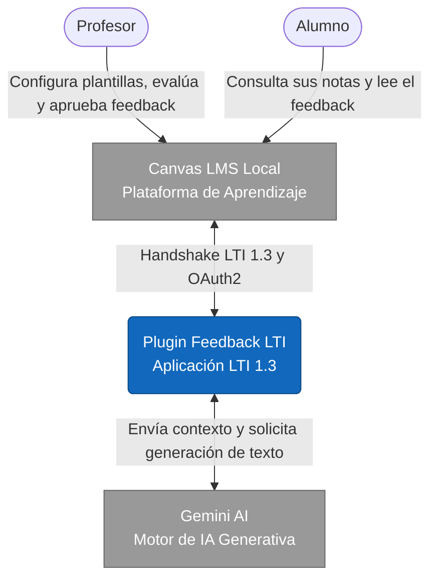
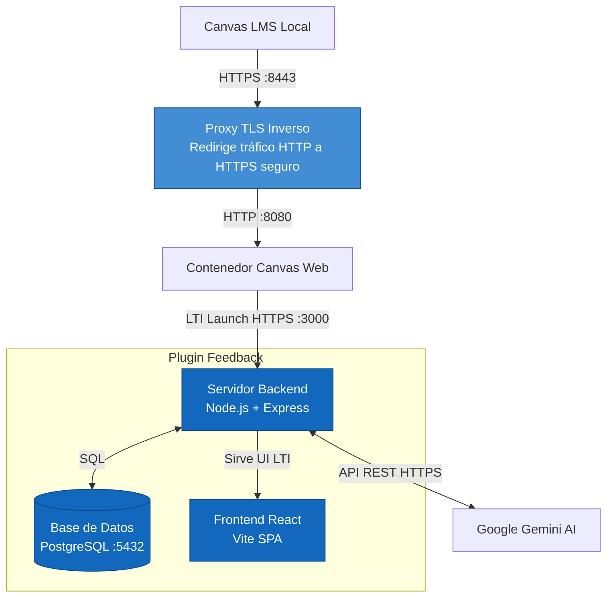

# Arquitectura del Sistema (C4 Model)

Este documento describe la arquitectura técnica de **Plugin Feedback** utilizando un enfoque inspirado en el [Modelo C4](https://c4model.com/). 

## 1. Diagrama de Contexto (Nivel 1)

Muestra cómo interactúa el sistema principal con los usuarios y los sistemas externos (Canvas LMS y Gemini AI).

## 2. Diagrama de Contenedores (Nivel 2)

Hace un "zoom in" dentro del "Plugin Feedback LTI" para mostrar sus contenedores internos y cómo se distribuye el flujo de datos.

## 3. Diccionario Técnico LTI 1.3

El protocolo **LTI (Learning Tools Interoperability) 1.3** es el estándar de seguridad que usa el plugin para comunicarse con Canvas. 

**Componentes Clave:**
*   **LTI Advantage:** Permite integraciones más profundas (como escribir calificaciones directamente en el libro de notas).
*   **OIDC Login Initiation:** Cuando el usuario hace clic en el Plugin dentro de Canvas, Canvas envía un `POST` inicial al backend para verificar identidad.
*   **JWKS (JSON Web Key Set):** El servidor backend posee una ruta criptográfica (típicamente `/jwks`) que Canvas consulta para validar que los mensajes provengan genuinamente del plugin.

> [!WARNING]
> Cualquier cambio en las rutas principales del backend (por ejemplo, cambiar la ruta de autenticación OIDC o JWKS) requerirá una reconfiguración completa de la herramienta dentro del panel de administración de Canvas LMS.
