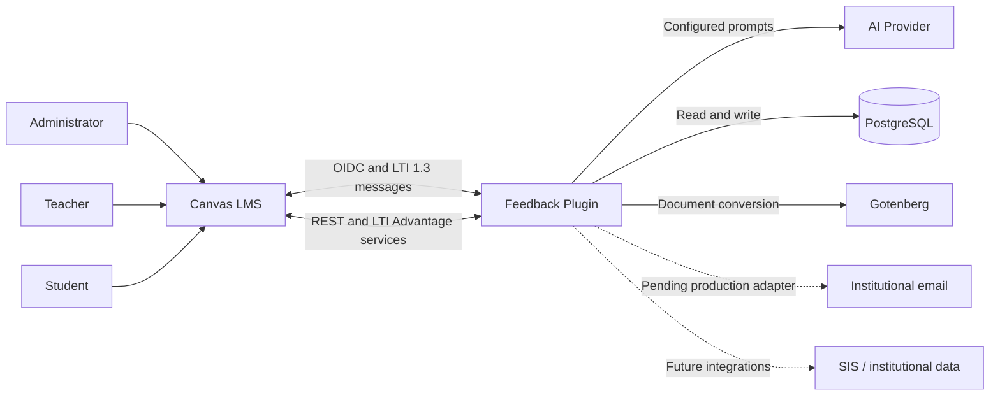
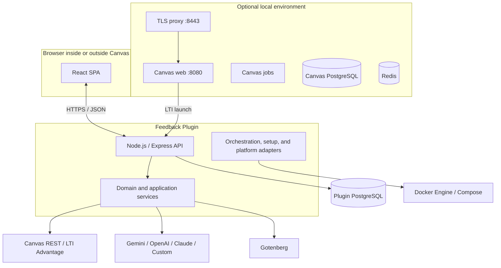
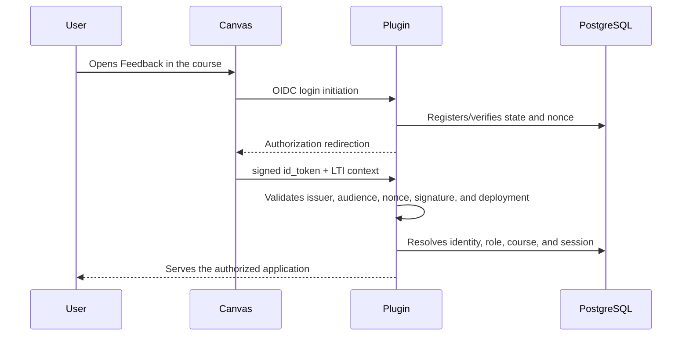

# System Architecture

This document describes the architecture observed in the current code. The project is an LTI 1.3 tool; local Canvas is external testing infrastructure, not a product module.

## 1. Context



### Actors

- **Administrator:** configures providers, permissions, global variables, and auditing.
- **Teacher:** configures templates/variables, generates, reviews, and sends feedback.
- **Student:** checks feedback, grades, and permitted preferences.
- **Operations:** manages deployment, secrets, migrations, logs, and recovery.

## 2. Logical containers



In development, Vite serves the SPA on `:5173`. In mode 1 or in the runtime image, the backend serves the `dist` build and exposes the API on the same configured process/origin.

## 3. Monorepo structure

```text
apps/client/src/
├── app/                 # React composition and global boundaries
├── components/          # reusable atoms/molecules
├── modules/             # functional modules and loading strategies
├── services/            # frontend HTTP clients
└── views/               # views by role and flow

apps/server/src/
├── domain/              # entities, identity, and core rules
├── services/            # use cases and integrations
├── repositories/        # PostgreSQL persistence
├── controllers/         # HTTP adaptation
├── routes/              # endpoint composition
├── security/            # identity, keys, and validations
├── authz/               # authorization by role and context
├── middlewares/         # cross-cutting HTTP middlewares
├── modules/             # bounded capabilities (notifications, formatting, etc.)
├── adapters/            # boundaries with external services
├── stores/              # session stores (LTI launch, Redis/Map)
├── local/               # adapters for Canvas, TLS, and browser for local mode
├── data/                # data access and PostgreSQL pool
└── utils/               # shared server utilities
```

`package.json` declares workspaces `apps/*` and `packages/*`; in the current tree, only `apps/client` and `apps/server` contain active packages. Do not document non-existent shared packages.

## 4. LTI 1.3 launch flow



Relevant routes/configuration:

- OIDC initiation: `/api/lti/login`;
- callback/target: `/api/lti/callback`;
- public JWKS: `/api/lti/jwks`;
- local placement: `config/lti_placement.json`.

Changing host, paths, or scopes requires updating the Canvas Developer Key/configuration.

## 5. Feedback generation flow

1. The authorized identity selects course, assignment, and students.
2. The backend gets submissions, grades, rubrics, and authorized context from Canvas/DB.
3. The resolvers compute variables enabled for the course.
4. The template composes the prompt and the factory selects the AI provider.
5. The result is persisted with a review status.
6. The teacher can edit, approve, or discard it.
7. Sending publishes the comment/feedback in Canvas and registers audit/notification.

Generation must not grant sending permission: authorization, state, and course membership are validated again at the edge of each action.

## 6. Data and persistence

- The versioned plugin migrations live in `packages/plugin-database/migrations/`.
- `npm run db:migrate` is the explicit entry point.
- `AUTO_MIGRATE=true` allows migrating at startup, but production must consciously decide whether to separate migration and runtime.
- The production compose includes a `migrate` service before `app`; this composition still requires staging validation.
- Local Canvas has its own database and volumes; it does not mix with the plugin's PostgreSQL.

## 7. Installation and platform

Orchestration applies separation of concerns:

- probes observe platform, CLI, daemon, context, and permissions without mutating;
- policies convert evidence into decisions/messages;
- installers `Win…`, `Mac…`, and `Linux…` contain native actions;
- Linux separates APT distribution, rootless strategy, workspace permissions, and Canvas archive;
- `EnvironmentSetup` coordinates, but must not accumulate commands from all systems.

Windows-specific logic must not run on Linux and vice versa. The adapter name communicates that boundary; shared logic remains without a platform prefix.

## 8. Local/production separation

Files with the `.local.js` suffix or `_local.js` variants are versioned modules intended for the local composition root. The suffix does not mean "secret file". They must follow two rules:

1. they do not contain real credentials;
2. they are not reachable in production except through explicit and validated local enablement.

The architectural preference is to share domain/use cases and substitute adapters. Do not duplicate complete functional logic to create a local edition.

## 9. Security and trust boundaries

- Canvas, AI providers, student files, and HTTP parameters are untrusted inputs.
- LTI requires validating signature, issuer, audience, deployment, `state`, `nonce`, roles, and context.
- Canvas tokens and AI keys must be encrypted/persisted outside of logs and responses.
- Local identity bypass requires local mode and signed tokens; it must remain disabled in production.
- Gotenberg processes untrusted documents and must remain isolated, with timeouts and limits.
- Rootless Docker reduces local privileges, but it does not make unknown images safe.

## 10. Known constraints

- LTI registration and the institutional runtime do not yet have E2E certification in real staging.
- Production email is not implemented; the local adapter logs simulations.
- Creating resolvers from the UI writes code to the filesystem and requires a redesign for immutable/scaled deployments.
- The legacy scripts folder was deleted and the commands consolidated in the corresponding applications.
- Current E2E tests do not yet solidly cover all critical flows.

See [TECHNICAL_DEBT.md](TECHNICAL_DEBT.md) for owners and closing criteria.
