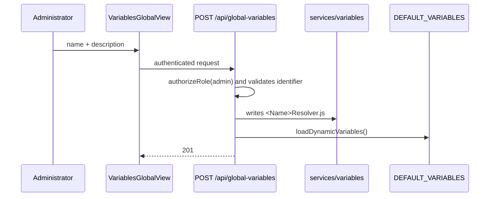

# Global and Course Variables (RF06)

## 1. Status

The view, routes, and dynamic discovery are implemented. The creation of a new variable does not yet have a production E2E acceptance, and its strategy of writing code to the filesystem is incompatible with immutable/scaled deployments without additional work.

Therefore, RF06 is classified as **experimentally implemented; pending validation and operational redesign**.

## 2. Base variables

`CourseVariables.js` registers:

| Identifier | Name |
|---|---|
| `trayectoria_academica` | Academic trajectory in the course |
| `calificaciones_previas` | Previous grades |
| `desempeno_otras_asignaturas` | Performance in other subjects |
| `perfil_ingreso` | Entry profile |
| `situacion_academica_anterior` | Previous academic situation |

`promedio_curso`, `calificacion`, and `nombre_estudiante` are system/template variables excluded from configurable weighting.

## 3. Configuration by course

The teacher enables variables and assigns weights. The domain validates:

- valid input object;
- individual weight between 0 and 100;
- sum of active variables equals 100% (tolerance 0.01);
- absent variables remain disabled;
- names/descriptions come from the server catalog.

The configuration is persisted via `CourseVariablesService` and the course routes.

## 4. Current global creation

The route only accepts letters, numbers, and underscores, avoids overwriting registered keys, and generates a class that inherits from `BaseVariableResolver`.

## 5. Discovery

When loading the module, `loadDynamicVariables()` iterates through `apps/server/src/services/variables/*Resolver.js`, extracts the key from `super('{{variable}}')` and the description from `// NAME:`. It adds what it finds to the in-memory registry.

The generated resolver currently returns a simulated data point based on the student. Creating the file does not automatically integrate a real institutional source.

## 6. Constraints and risks

- The production image runs as the `node` user and its code should be immutable.
- Multiple replicas do not automatically share the generated file.
- Restarts/redeploys can lose changes if no volume/commit exists.
- Writing JavaScript from a request increases the security and audit surface.
- The regex parser depends on the textual shape of the class.
- There is no formal review, versioning, rollback, or testing flow for the resolver.
- Simulated data can be mistakenly presented as real data.

Do not solve this by granting global write access to `apps/server/src` in production.

## 7. Recommended direction

Separate two concepts:

1. **Resolver types catalog:** reviewed/versioned code that knows how to fetch a metric.
2. **Variable definition/configuration:** PostgreSQL record that selects type, label, parameters, status, and scope.

An administrator could create configurations from approved types without generating code. New integrations would require a pull request/deploy, or a strictly validated and sandboxed declarative DSL.

For multiple replicas, the catalog/configuration must be consistent, cacheable, and invalidatable without restarting all processes.

## 8. RF06 Acceptance criteria

- [ ] only an administrator can create/disable a global variable;
- [ ] invalid names, duplicates, and malicious payloads are rejected;
- [ ] the variable persists across restarts and deployments;
- [ ] all replicas observe the same version;
- [ ] author, date, source, and changes are logged;
- [ ] resolver uses an approved real source or is clearly marked as simulated;
- [ ] failures/timeouts do not break the entire generation;
- [ ] course configuration preserves sum and permissions;
- [ ] secure rollback/deletion exists;
- [ ] E2E verifies creation, assignment, generation, and rendering;
- [ ] production maintains a read-only code filesystem.

Until these criteria are completed, do not enable dynamic creation in an institutional environment.
