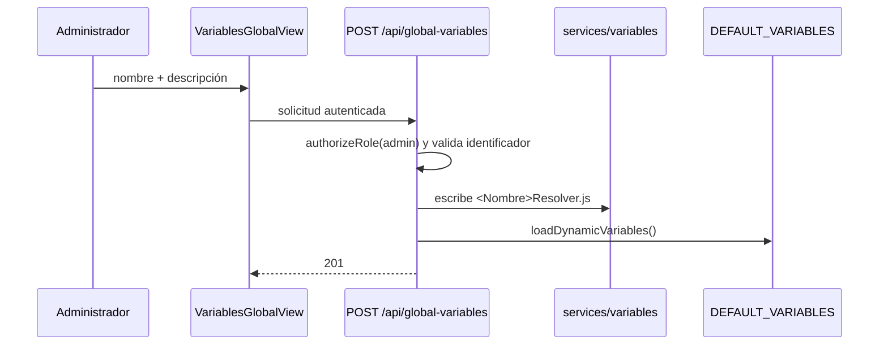

# Variables globales y por curso (RF06)

## 1. Estado

La vista, rutas y descubrimiento dinámico están implementados. La creación de una variable nueva no cuenta todavía con una aceptación E2E productiva y su estrategia de escribir código al filesystem es incompatible con despliegues inmutables/escalados sin trabajo adicional.

Por tanto, RF06 se clasifica como **implementado experimentalmente; pendiente de validación y rediseño operacional**.

## 2. Variables base

`CourseVariables.js` registra:

| Identificador | Nombre |
|---|---|
| `trayectoria_academica` | Trayectoria académica en el curso |
| `calificaciones_previas` | Calificaciones previas |
| `desempeno_otras_asignaturas` | Desempeño en otras asignaturas |
| `perfil_ingreso` | Perfil de ingreso |
| `situacion_academica_anterior` | Situación académica anterior |

`promedio_curso`, `calificacion` y `nombre_estudiante` son variables de sistema/plantilla excluidas de la ponderación configurable.

## 3. Configuración por curso

El profesor habilita variables y asigna ponderaciones. El dominio valida:

- objeto de entrada válido;
- ponderación individual entre 0 y 100;
- suma de variables activas igual a 100% (tolerancia 0,01);
- variables ausentes quedan desactivadas;
- nombres/descripciones provienen del catálogo del servidor.

La configuración se persiste mediante `CourseVariablesService` y las rutas del curso.

## 4. Creación global actual

La ruta solo acepta letras, números y guion bajo, evita sobrescribir claves registradas y genera una clase que hereda `BaseVariableResolver`.

## 5. Descubrimiento

Al cargar el módulo, `loadDynamicVariables()` recorre `apps/server/src/services/variables/*Resolver.js`, extrae la clave desde `super('{{variable}}')` y la descripción desde `// NAME:`. Añade lo encontrado al registro en memoria.

El resolver generado devuelve actualmente un dato simulado basado en el estudiante. Crear el archivo no integra automáticamente una fuente institucional real.

## 6. Restricciones y riesgos

- La imagen de producción ejecuta como usuario `node` y su código debería ser inmutable.
- Varias réplicas no comparten automáticamente el archivo generado.
- Reinicios/redeploys pueden perder cambios si no existe volumen/commit.
- Escribir JavaScript desde una petición aumenta superficie de seguridad y auditoría.
- El parser por regex depende de la forma textual de la clase.
- No hay flujo formal de revisión, versionado, rollback o prueba del resolver.
- Los datos simulados pueden presentarse erróneamente como datos reales.

No resuelva esto otorgando escritura global a `apps/server/src` en producción.

## 7. Dirección recomendada

Separar dos conceptos:

1. **Catálogo de tipos de resolver:** código revisado/versionado que sabe obtener una métrica.
2. **Definición/configuración de variable:** registro PostgreSQL que selecciona tipo, etiqueta, parámetros, estado y alcance.

Un administrador podría crear configuraciones a partir de tipos aprobados sin generar código. Nuevas integraciones requerirían pull request/deploy, o un DSL declarativo estrictamente validado y sandboxed.

Para múltiples réplicas, el catálogo/configuración debe ser consistente, cacheable e invalidable sin reiniciar todos los procesos.

## 8. Criterios de aceptación RF06

- [ ] solo administrador puede crear/desactivar una variable global;
- [ ] nombres inválidos, duplicados y payloads maliciosos se rechazan;
- [ ] la variable persiste tras reinicio y despliegue;
- [ ] todas las réplicas observan la misma versión;
- [ ] se registra autor, fecha, fuente y cambios;
- [ ] resolver usa una fuente real aprobada o se marca claramente como simulado;
- [ ] fallos/timeouts no rompen la generación completa;
- [ ] configuración por curso conserva suma y permisos;
- [ ] existe rollback/eliminación segura;
- [ ] E2E verifica creación, asignación, generación y renderizado;
- [ ] producción mantiene filesystem de código de solo lectura.

Hasta completar estos criterios, no habilite creación dinámica en un entorno institucional.
