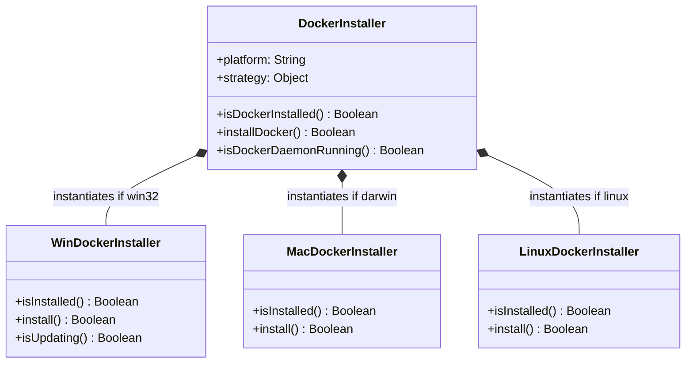
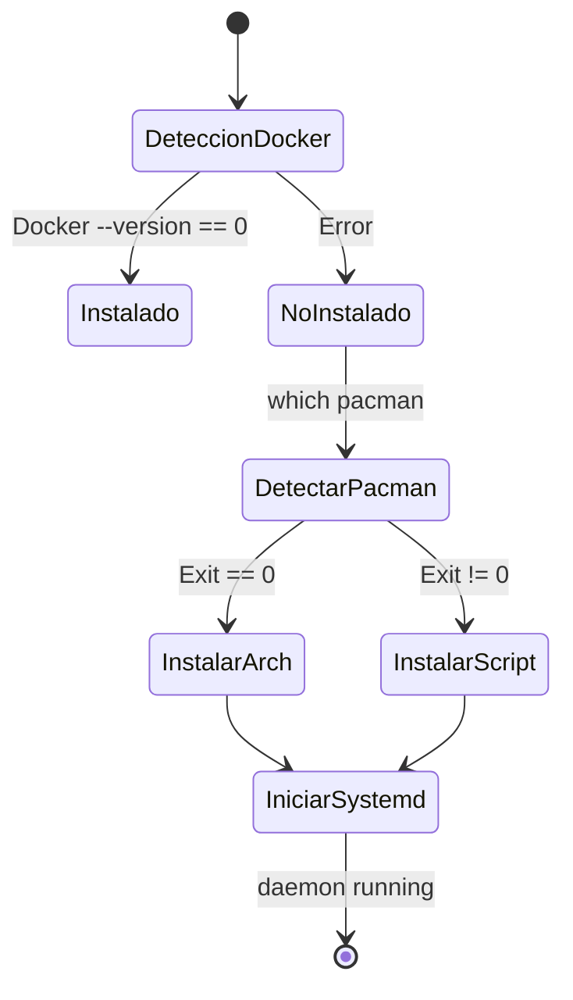
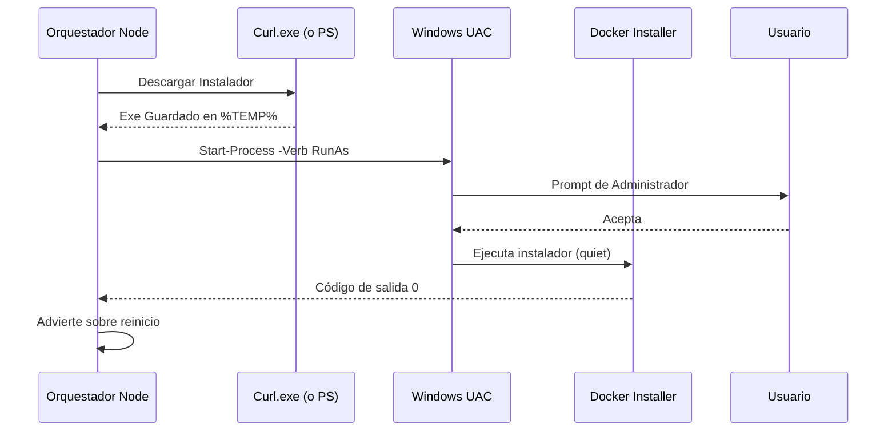

# Documentación Técnica Exhaustiva: Estrategia de Instalación Multiplataforma

## Índice de Contenidos
1. [Introducción y Diseño Arquitectónico](#1-introducción-y-diseño-arquitectónico)
2. [Estrategia de Instalación en Linux](#2-estrategia-de-instalación-en-linux)
3. [Estrategia de Instalación en Windows](#3-estrategia-de-instalación-en-windows)
4. [Estrategia de Instalación en macOS](#4-estrategia-de-instalación-en-macos)
5. [Casos Límite y Resiliencia del Sistema](#5-casos-límite-y-resiliencia-del-sistema)

---

## 1. Introducción y Diseño Arquitectónico

Este documento sirve como la única fuente de verdad para el subsistema de orquestación responsable de preparar el entorno del host para la ejecución de contenedores. Dada la inmensa fragmentación de los sistemas operativos modernos, el orquestador no puede depender de un único script bash o batch. En su lugar, emplea un patrón de diseño **Strategy (Estrategia)** inyectado a través de una **Fachada (Facade)** en Node.js.

### 1.1 El Problema a Resolver
El arranque en "cero clicks" (zero-configuration startup) exige que, sin importar si un desarrollador utiliza un MacBook M3, un PC gamer con Windows 11 o un servidor con Arch Linux, el sistema sea capaz de:
1. Auditar si Docker Engine y Docker Compose están instalados.
2. Si no lo están, descargar los binarios correctos de la arquitectura y sistema operativo.
3. Instalar dependencias respetando los requerimientos de elevación de privilegios (Sudo, UAC, Gatekeeper).
4. Arrancar el daemon de Docker y asegurar que el orquestador principal puede comunicarse con el socket de Docker.

### 1.2 Patrón Strategy y Facade
El archivo `DockerInstaller.js` actúa como el **Facade**. Oculta la complejidad de la plataforma subyacente. Su única responsabilidad es invocar `os.platform()`, que devuelve `win32`, `darwin` o `linux`. Según este valor, instancia una de las tres clases de estrategia:
- `WinDockerInstaller`
- `MacDockerInstaller`
- `LinuxDockerInstaller`

Esta separación arquitectónica obedece al **Principio de Responsabilidad Única (SRP)** y al **Principio Abierto/Cerrado (OCP)** de SOLID. Cualquier fallo en la estrategia de Windows no afectará ni contaminará el código de Linux.



### 1.3 Principios de Ejecución de Subprocesos (`runCommand` y `execa`)
Todas las interacciones con el sistema operativo se realizan a través de un wrapper interno llamado `runCommand`, el cual está fuertemente acoplado a la librería `execa`.
**¿Por qué no usar `child_process.spawnSync`?**
Porque Node.js es mono-hilo (Single Threaded Event Loop). Si ejecutamos una descarga síncrona que tarda 3 minutos, todo el servidor Node.js se congela. No puede procesar logs, no puede actualizar la UI de consola y no puede responder a señales de interrupción (`SIGINT` Ctrl+C). `execa` permite delegar el proceso al sistema operativo, manteniendo el Event Loop libre, pero devolviendo una Promesa que hace que el código se lea de forma síncrona mediante `async/await`.

---

## 2. Estrategia de Instalación en Linux

La fragmentación en Linux es el mayor desafío técnico. Las distribuciones (distros) utilizan diferentes gestores de paquetes (`apt`, `dnf`, `yum`, `pacman`, `zypper`). Un comando rígido como `apt-get` rompería el sistema para el 40% de los usuarios.

### 2.1 Arquitectura General en Linux
El instalador divide Linux en dos grandes mundos:
1. **Mundo Arch:** Rolling releases que utilizan `pacman`. Se detectan proactivamente porque el script genérico de Docker no las soporta.
2. **Mundo Genérico (Debian/RHEL):** Distribuciones soportadas por el script universal de conveniencia de Docker (`get.docker.com`).



### 2.2 Detalle Exhaustivo de Comandos (Linux)

#### 2.2.1 Comando: Validación de Instalación Previa
```javascript
runCommand('docker', ['--version'])
```
*   **Objetivo:** Determinar si los binarios CLI de Docker existen y son accesibles en el `$PATH` del usuario.
*   **Momento de Ejecución:** Es el primer comando que se ejecuta en el flujo, dentro de `isInstalled()`.
*   **Razón de elección:** Es el comando menos invasivo. No interactúa con el daemon (el daemon podría estar apagado, pero el binario instalado).
*   **Salida Esperada:** `Docker version 24.0.5, build ced0996` (stdout).
*   **Códigos de Salida:**
    *   `0`: El binario existe y respondió.
    *   `127`: Comando no encontrado (Command not found).
*   **Interpretación del Error:** Si es distinto de 0, asumimos que Docker no está instalado o los binarios están corruptos/no enrutados.
*   **Acción del Sistema:** El sistema retorna `false` en `isInstalled()`, forzando al orquestador a iniciar la ruta `install()`.
*   **Excepciones:** Atrapadas internamente por `execa`. El log de depuración (si está habilitado) registrará la ausencia del comando.

#### 2.2.2 Comando: Detección de Arch Linux
```javascript
runCommand('which', ['pacman'])
```
*   **Objetivo:** Verificar si el gestor de paquetes de Arch Linux (`pacman`) está presente.
*   **Momento de Ejecución:** Al inicio de `install()`, para bifurcar la lógica de instalación.
*   **Dependencias:** El comando `which` (POSIX standard).
*   **Por qué esta estrategia:** El script `get.docker.com` detiene la ejecución violentamente si detecta Arch Linux. Debemos adelantarnos a este fallo.
*   **Salidas Comunes de Error:** Ninguna salida (stderr vacío), pero el código de salida es `1`.
*   **Acción del Sistema:** Si devuelve `0`, bifurcamos al bloque "Arch". Si devuelve `1`, caemos al bloque "Genérico".

#### 2.2.3 Comando: Instalación Nativa en Arch
```javascript
runCommand('sudo', ['pacman', '-S', '--noconfirm', 'docker', 'docker-compose', 'docker-buildx'])
```
*   **Objetivo:** Instalar el ecosistema completo desde los repositorios oficiales `[Extra]`.
*   **Parámetros:** `-S` (Sync/Install), `--noconfirm` (Evitar pausas interactivas preguntando "Proceed with installation? [Y/n]").
*   **Dependencias:** Requiere que el usuario pertenezca al archivo `sudoers` (grupo `wheel`).
*   **Fallo Común 1 (Privilegios):** Si el usuario no tiene permisos de sudo sin contraseña, el proceso se quedará esperando (STALL). *Mitigación actual:* El CLI advierte al usuario "Se requerirán privilegios de root".
*   **Fallo Común 2 (Bloqueo de base de datos):** Salida `error: failed to commit transaction (conflicting files)`. Ocurre si la base de datos de Pacman está corrupta.
*   **Acción del Sistema:** Si falla (código != 0), registra el error crítico en logs y devuelve `false`. La instalación se aborta, dejando al usuario la responsabilidad de reparar su gestor de paquetes.

#### 2.2.4 Comando: Descarga del Script Universal (Mundo Genérico)
```javascript
runCommand('curl', ['-fsSL', 'https://get.docker.com', '-o', 'get-docker.sh'])
```
*   **Objetivo:** Obtener el instalador oficial de Docker para distros basadas en Debian/Fedora/RHEL.
*   **Parámetros:** `-f` (Falla silenciosamente en errores HTTP, sin imprimir HTML), `-sS` (Silencioso pero muestra errores), `-L` (Sigue redirecciones, crucial para HTTPS).
*   **Por qué se eligió:** Es la práctica recomendada oficial para entornos de desarrollo. Instala Docker Engine y `docker-compose-plugin` simultáneamente, configurando automáticamente repositorios apt/yum y firmas GPG.
*   **Errores (Red):** Código `6` (Could not resolve host) si no hay internet. Código `28` (Timeout) en conexiones lentas.
*   **Acción del Sistema:** Falla la instalación inmediatamente con un mensaje de error de red.

#### 2.2.5 Comando: Ejecución del Script Universal
```javascript
runCommand('sudo', ['sh', 'get-docker.sh'])
```
*   **Objetivo:** Ejecutar la instalación.
*   **Salida Esperada:** Decenas de líneas indicando la agregación de llaves GPG, actualización de apt, e instalación de dependencias `containerd.io`, `docker-ce-cli`.
*   **Qué hace internamente:** Detecta la distribución (ej. Ubuntu 22.04 jammy), añade el repositorio `download.docker.com`, invoca `apt-get install`.
*   **Manejo de Errores:** Si el script devuelve algo distinto de `0`, significa un fallo profundo del sistema de paquetes del OS, el cual se propaga a los logs como "Fallo instalando Docker".

#### 2.2.6 Comando: Integración con Systemd
```javascript
runCommand('sudo', ['systemctl', 'start', 'docker'])
runCommand('sudo', ['systemctl', 'enable', 'docker'])
```
*   **Objetivo:** Encender el daemon inmediatamente (`start`) y garantizar que arranque en futuros reinicios del PC (`enable`).
*   **Dependencias:** El host debe usar `systemd` como Init System (lo cual es el caso para el 99% de distribuciones modernas). WSL1/WSL2 en Windows puede no tener systemd, pero este código solo corre en Linux nativo.
*   **Error si el Daemon falla:** Código `1` o `3`. Indica corrupción del socket, falta de recursos del kernel o errores de configuración en `/etc/docker/daemon.json`.

---

## 3. Estrategia de Instalación en Windows

Windows es un entorno extremadamente hostil para la orquestación en CLI de herramientas orientadas a Linux. Docker Desktop actúa como un proxy que configura una Máquina Virtual en Hyper-V o una instancia en WSL2. 

### 3.1 Arquitectura y Peculiaridades
1. **Powershell vs CMD:** Node.js por defecto lanza procesos a través de `cmd.exe`. El orquestador fuerza el uso explícito de `powershell` o ejecutables nativos.
2. **User Account Control (UAC):** Un script no puede elevar sus propios privilegios de forma invisible sin lanzar una ventana gráfica.
3. **Paths Virtualizados:** Docker se instala en `C:\Program Files`, ruta que contiene espacios, un problema clásico en la manipulación de arrays de comandos.



### 3.2 Detalle Exhaustivo de Comandos (Windows)

#### 3.2.1 Detección del Instalado Previo
```javascript
fs.existsSync('C:\\Program Files\\Docker\\Docker\\resources\\bin\\docker.exe')
```
*   **Objetivo:** Verificación pasiva. En Windows, invocar comandos mediante child processes es lento (penalización del tiempo de arranque). Un simple chequeo de archivo en el disco es 100x más rápido.
*   **Falsos Positivos:** El archivo puede existir pero Docker Desktop no estar funcional o estar dañado. En este caso, la capa superior del orquestador intentará invocar el daemon, fallará, y activará los mecanismos de recuperación de daemon.

#### 3.2.2 Descarga Híbrida del Instalador
```javascript
// Intento Primario
runCommand('curl.exe', ['-L', '-o', dest, url])
// Fallback
runCommand('powershell', ['-Command', `Invoke-WebRequest -Uri "${url}" -OutFile "${dest}"`])
```
*   **El Problema Histórico:** `Invoke-WebRequest` en PowerShell 5.1 decodifica y parsea la respuesta en la memoria RAM antes de escribirla. Para un archivo de 600MB (Instalador de Docker), esto congela el sistema y dispara el uso de memoria.
*   **Estrategia:** Windows 10 (compilaciones recientes) y Windows 11 traen un binario `curl.exe` genuino integrado. El intento primario invoca este binario nativo, el cual hace streaming directo al disco (Zero-copy memory overhead).
*   **Fallbacks:** Si `curl.exe` no existe (Windows 10 antiguo), `execa` arrojará un error `ENOENT`. El bloque `catch` entra en acción y llama al lento pero seguro `Invoke-WebRequest` como red de seguridad.
*   **Salida de Error (Network):** Si la red se cae durante la descarga, el archivo resultante quedará corrupto o con 0 bytes. `runCommand` registrará un exit code no nulo.
*   **Recuperación:** Se cancela la instalación y se notifica al usuario que verifique su conexión. No se reintenta automáticamente para no agotar la red innecesariamente.

#### 3.2.3 Instalación Silenciosa con UAC
```javascript
runCommand('powershell', ['-Command', `Start-Process -FilePath "${dest}" -ArgumentList "install --quiet --accept-license" -Wait -Verb RunAs`])
```
*   **Desglose del Comando:**
    *   `Start-Process`: Cmdlet de PowerShell para lanzar ejecutables.
    *   `--quiet --accept-license`: Argumentos pasados al EXE del instalador de Docker para suprimir su propia interfaz gráfica (GUI) y aceptar los términos (EULA) automáticamente.
    *   `-Wait`: CRÍTICO. Congela el proceso de PowerShell hasta que el instalador termine. Sin esto, Node.js creería que la instalación duró 0.1 segundos y seguiría con el flujo, rompiendo toda la orquestación.
    *   `-Verb RunAs`: Instruye a Windows a escalar el proceso a "Nivel de Administrador". Esto genera un bloqueo gráfico (Secure Desktop) pidiendo al usuario que acepte los permisos.
*   **Casos de Error y Comportamiento Asíncrono:**
    *   Si el usuario **cancela** el prompt UAC, PowerShell recibe un código de error y `Start-Process` arroja una excepción en el shell. `runCommand` captura esto, `success` será `false`, y se alerta que "El usuario denegó los permisos".
    *   Si el sistema está configurado para requerir contraseña de administrador y el usuario es estándar, fallará si se introduce mal.
*   **Estados Post-Instalación:** Docker Desktop en Windows frecuentemente requiere que el usuario cierre sesión (log out) e inicie sesión de nuevo para aplicar la membresía al grupo local `docker-users`. El script emite un `boot.warn` previniendo esto.

#### 3.2.4 Detección de Instalación en Curso
```javascript
runCommand('tasklist', ['/fi', 'imagename eq Docker Desktop Installer.exe'])
```
*   **Objetivo:** Si Docker decide actualizarse en segundo plano durante nuestro proceso de "Esperando al Daemon", el sistema no debe fallar con un timeout de inmediato.
*   **Mecánica:** Filtra la lista de tareas de Windows buscando el binario de instalación. Si encuentra coincidencias, el temporizador adaptativo relaja la presión e informa al usuario: "Docker se está actualizando".

---

## 4. Estrategia de Instalación en macOS

macOS (especialmente en versiones recientes como macOS Sonoma o Sequoia) presenta barreras de seguridad formidables, siendo la característica "Gatekeeper" el obstáculo principal para scripts de instalación en la terminal.

### 4.1 Arquitectura (Apple Silicon vs Intel)
Desde 2020, Apple introdujo procesadores ARM (M1, M2, M3). Aunque Rosetta 2 puede traducir binarios x64 a ARM en tiempo real, ejecutar el Docker Daemon traducido destruye el rendimiento, consume batería en exceso y genera fallos sutiles de compilación de imágenes Docker (las imágenes se construirían para arquitectura AMD64 accidentalmente). Es de **misión crítica** detectar la arquitectura correcta y descargar el DMG nativo.

```mermaid
graph TD
    A[Inicio Mac Installer] --> B{¿Tiene Homebrew?}
    B -- Sí --> C[Recomendar OrbStack]
    C --> D{¿Usuario Acepta?}
    D -- Sí --> E[brew install orbstack]
    D -- No --> F[Descargar Docker DMG]
    B -- No --> F
    F --> G{¿os.arch() == arm64?}
    G -- Sí --> H[Bajar DMG Apple Silicon]
    G -- No --> I[Bajar DMG Intel]
    H --> J[Montar hdiutil]
    I --> J
    J --> K[Copiar a /Applications]
    K --> L[Abrir App / Lanzar Gatekeeper]
```

### 4.2 Detalle Exhaustivo de Comandos (macOS)

#### 4.2.1 Detección Híbrida de Binarios
```javascript
fs.existsSync('/Applications/Docker.app/.../bin/docker') || fs.existsSync('/Applications/OrbStack.app')
```
*   **Objetivo:** Confirmar si el motor de contenedores existe. Dado que OrbStack es una alternativa altamente superior en macOS (en términos de optimización de disco y CPU), el orquestador tiene soporte de primera clase (first-class support) para él.

#### 4.2.2 Sugerencia de OrbStack vía Homebrew
```javascript
runCommand('brew', ['--version'])
// Si existe:
runCommand('brew', ['install', '--cask', 'orbstack'])
```
*   **Lógica de Decisión:** Homebrew es el estándar de facto para gestores de paquetes en macOS, pero no viene preinstalado. Primero validamos si existe. Si el usuario cuenta con él, le sugerimos amigablemente OrbStack.
*   **Descarga Cask:** `brew install --cask` descarga binarios compilados (GUI apps) en vez de compilar desde fuente.
*   **Error Común:** Si el comando es cancelado o se corrompe el servidor de Apple/Homebrew, la instalación falla, el orquestador insta al usuario a instalar de forma manual.

#### 4.2.3 Detección de Arquitectura
```javascript
const arch = os.arch() === 'arm64' ? 'arm64' : 'amd64';
const url = `https://desktop.docker.com/mac/main/${arch}/Docker.dmg`;
```
*   **Razón Subyacente:** Node.js (cuando se instala nativamente en una Mac M-series) expone `os.arch()` como `arm64`. Interpolamos directamente este string para conformar la URL de descarga del Content Delivery Network (CDN) de Docker.

#### 4.2.4 Manipulación de Archivos DMG
```javascript
runCommand('curl', ['-L', '-o', dest, url])
runCommand('hdiutil', ['attach', dest])
runCommand('cp', ['-R', '/Volumes/Docker/Docker.app', '/Applications'])
runCommand('hdiutil', ['detach', '/Volumes/Docker'])
```
*   **Flujo del Sistema de Archivos:**
    1.  `curl` baja el archivo de ~700MB a la carpeta temporal del sistema (`os.tmpdir()`).
    2.  `hdiutil attach` monta el archivo `.dmg` en el sistema de volúmenes virtual de macOS (típicamente `/Volumes/Docker`). Es un comando bloqueante que no devuelve el control hasta que el volumen virtual está listo.
    3.  `cp -R` realiza la copia recursiva del Bundle de la aplicación (`.app`) a la carpeta del sistema `/Applications`. Este es el equivalente por terminal a "arrastrar el ícono de la app a la carpeta de aplicaciones" que ven los usuarios.
    4.  `hdiutil detach` desmonta (expulsa) el instalador virtual para no consumir RAM ni espacio de montaje innecesario.
*   **Fallos Críticos:**
    *   Si no hay suficiente espacio en disco, `cp -R` fallará a la mitad de la copia. Código de error `1`.
    *   Si `/Applications` tiene permisos alterados por MDM corporativo, la copia puede fallar por falta de permisos de acceso.

#### 4.2.5 Ejecución Forzada (El Problema de Gatekeeper)
```javascript
runCommand('open', ['-a', 'Docker'])
```
*   **Análisis del Problema Insoluble:** En macOS, es criptográficamente imposible realizar una instalación silenciosa (desatendida) de Docker Desktop. Docker Desktop requiere instalar "Helper Tools" para crear interfaces de red virtuales (`vifs`) en el núcleo (kernel) de Darwin. Esto **obligatoriamente** requiere el prompt de elevación gráfica de macOS, el cual solo se dispara cuando la aplicación se abre (LaunchServices).
*   **Mitigación de UX (User Experience):** El comando `open -a` lanza la app. El script emite una alerta naranja fuerte: "macOS bloqueará la ejecución... DEBES confirmar los cuadros de diálogo de seguridad". El script se queda en un bucle esperando la activación del socket del daemon.

---

## 5. Casos Límite y Resiliencia del Sistema

El orquestador no existe en el vacío; existe en computadoras de usuarios que podrían estar bajo redes inestables, proxies corporativos o máquinas corruptas.

### 5.1 Docker "Fantasma" (Archivos Presentes, Daemon Roto)
*   **Problema:** `isDockerInstalled()` devuelve `true` porque el archivo binario (`docker.exe`, `/bin/docker`) se encontró físicamente, pero el motor está destruido o mal configurado y no arranca.
*   **Resiliencia:** El orquestador delega la responsabilidad a `waitForDaemon()`. Si Docker no responde un "ping" a su socket en el tiempo máximo (600 segundos), se arroja un error final de timeout. La capa superior capturará este error y pedirá al usuario que revise manualmente su instalación.
*   **Razones Comunes:** 
    *   Windows: Subsistema WSL2 colapsado. Requiere que el usuario corra `wsl --update` o reinicie el servicio `LxssManager`.
    *   Linux: Conflicto con `containerd` o configuraciones de red bloqueando el socket `docker.sock`.

### 5.2 Descargas Incompletas o Archivos Dañados
*   **Problema:** Se interrumpe la conexión durante la descarga con `curl`. El archivo DMG o EXE es guardado, pero tiene un tamaño incorrecto y está corrupto.
*   **Resiliencia:** 
    *   Windows: `Start-Process` intentará ejecutar el binario corrupto. Windows retornará un error de "Formato ejecutable no válido", propagando un código de error al script. La instalación se da por fallida y se borra el progreso.
    *   Mac: `hdiutil attach` intentará verificar la suma de comprobación (checksum) nativa del archivo `.dmg` antes de montarlo. Al estar corrupto, `hdiutil` arrojará un error y detendrá la secuencia.

### 5.3 Ausencia de Privilegios Administrativos
*   **Problema:** El usuario ejecuta el orquestador desde una cuenta "Estándar" en vez de una "Administradora".
*   **Mitigación:** 
    *   Linux: Se le exige `sudo`. Si no tiene permisos, el sistema pedirá la contraseña en el terminal y tras fallar 3 veces, matará el proceso.
    *   Windows: El Prompt del UAC se mostrará con un campo de contraseña. Si el usuario cierra el prompt (botón Cancelar), `Start-Process` abortará.
    *   No hay automatización posible. Es un límite insuperable de seguridad del SO. Se requiere acción manual del usuario.

### 5.4 Dirty Volumes (Purga en Instalación Limpia)
*   **Problema:** El usuario instala el software sobre una versión anterior. Los volúmenes de base de datos de los contenedores conservan esquemas viejos o credenciales caducadas, causando errores criptográficos crípticos.
*   **Resiliencia:** Se implementó una bandera ambiental temporal llamada `KEYS_REGENERATED`. Durante `PreflightChecks.js`, si el orquestador nota que generó nuevas claves de cifrado, significa que es una instalación limpia.
*   **Acción del Sistema:** Invoca silenciosamente `runCommand('docker', ['compose', 'down', '-v'])`. El flag `-v` (volumes) destruye sin piedad cualquier persistencia huérfana de contenedores anteriores. Esto garantiza que la base de datos MySQL o PostgreSQL se regenere desde cero, importando correctamente los esquemas limpios en su primer arranque.

---

## 6. Conclusión
El sistema de instalación multiplataforma ha sido diseñado priorizando la predictibilidad y la seguridad sobre la ceguera algorítmica. No fuerza instalaciones donde es peligroso, delega a las APIs nativas correctas de cada SO (`curl` en lugar de buffers de Node, `.dmg` hdiutil nativo en Mac, `pacman` en Arch) y abraza el uso del Event Loop no bloqueante.

Cualquier futuro mantenedor que necesite extender el sistema (por ejemplo, para añadir soporte a FreeBSD o gestionar un instalador de Podman como drop-in replacement de Docker), solo necesita seguir la interfaz dictaminada por la Fachada: inyectar una clase nueva con los métodos `isInstalled()` e `install()`. El resto de la arquitectura resistirá inmutable.
