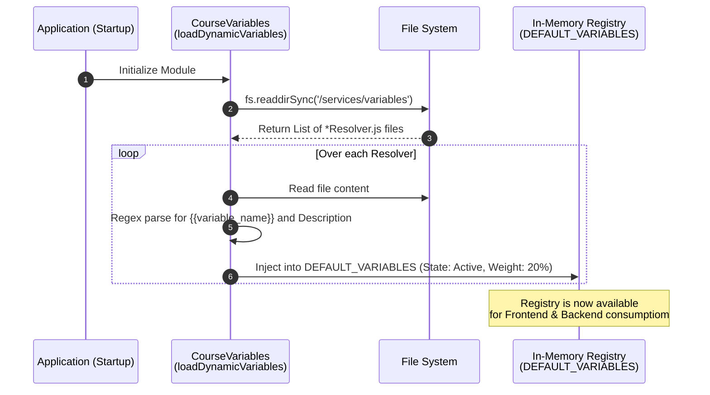

# Architecture Document: Global Variables Management (RF06)

**Status:** Active  
**Component:** `CourseVariables` & `VariablesGlobalView`  
**Patterns Applied:** Strategy Pattern, Metaprogramming (Code Generation), Dynamic Discovery

---

## 1. Executive Summary
The **Global Variables Management** module provides a dynamic, extensible architecture allowing system administrators to define new personalization variables (e.g., `{{forum_participation}}`) for Large Language Model (LLM) prompts. Instead of relying on traditional database migrations for new metrics, the system implements a "Documentation as Code" and "Infrastructure as Code" hybrid approach, automatically generating and discovering backend Resolvers at runtime.

## 2. Architectural Drivers
* **Extensibility:** Administrators must be able to add new variables to the system without requiring manual backend deployments or database schema alterations.
* **Maintainability:** The system must adhere to SOLID principles; specifically, the Open/Closed Principle (OCP) by allowing extensions without modifying existing logic.
* **Performance:** Variable resolution happens dynamically but requires high throughput during prompt generation.
* **Synchronization:** Avoid synchronization issues between the database state and the actual codebase's capability to resolve a variable.

## 3. System Architecture

The architecture leverages a physical file-based discovery system. Each variable is backed by a discrete class (a "Resolver") implementing the Strategy Pattern.

### 3.1. Dynamic Discovery Flow
At server startup, the `CourseVariables` domain service executes a dynamic scan of the `services/variables/` directory.



### 3.2. Metaprogramming (Code Generation)
When a new variable is created via the Admin UI, the backend API dynamically generates the source code for the new Resolver.

```mermaid
graph TD;
    subgraph Frontend [Client UI]
        A[Admin Panel (VariablesGlobalView)] -->|POST /api/global-variables| B(API Gateway)
    end
    
    subgraph Backend [Server Infrastructure]
        B --> C{Template Engine}
        C -->|fs.writeFileSync| D[NewResolver.js]
        D -.->|Extends| E[BaseVariableResolver.js]
    end
    
    style A fill:#e1f5fe,stroke:#03a9f4,stroke-width:2px
    style D fill:#e8f5e9,stroke:#4caf50,stroke-width:2px
    style E fill:#fff3e0,stroke:#ff9800,stroke-width:2px
```

## 4. Component View (C4)

### 4.1. Core Components
* **`BaseVariableResolver.js`**: The abstract class defining the contract for variable resolution. All dynamically generated and hardcoded resolvers inherit from this base class.
* **`CourseVariables.js`**: The orchestrator. It manages the in-memory state of `DEFAULT_VARIABLES` and exposes methods to merge these global variables with course-specific configurations stored in the database.
* **API Endpoints (`global_variables.routes.js`)**: 
    * `GET /api/global-variables`: Returns the in-memory registry of discovered resolvers.
    * `POST /api/global-variables`: Receives a mustache variable name and description, generating a new physical resolver file.
* **Client UI (`VariablesConfigView.jsx`)**: The Teacher-facing interface that fetches the global registry and allows assigning specific percentage weights per variable.

## 5. Operational View & Deployment Constraints

### 5.1. File System Permissions
The Metaprogramming approach requires write access to the disk at runtime.
> [!WARNING]
> In production environments (e.g., Docker containers or Kubernetes pods), the directory `apps/server/src/services/variables/` **must have write permissions** assigned to the Node.js execution user. 

### 5.2. Service Restarts
For a newly created variable to be discovered by the backend:
* **Development:** Tools like `nodemon` will detect the file system change (`.js` file creation) and automatically restart the server, making the variable instantly available.
* **Production:** The container or service must be reloaded/restarted for the dynamic loader to scan the directory again. If running in a clustered environment, ensure persistent shared storage (like EFS) is used for the `variables/` directory so all instances read the same resolvers.

## 6. Implementation Exclusions
To prevent internal system templates from being exposed as configurable weighted variables, an exclusion mechanism is implemented in `CourseVariables.js`:

```javascript
// System or template-exclusive variables that bypass weight configuration
const EXCLUDED_VARIABLES = ['promedio_curso', 'calificacion', 'nombre_estudiante'];
```
Any `Resolver.js` file mapping to these keys will be successfully compiled by the backend but omitted from the `GET /api/global-variables` payload.
